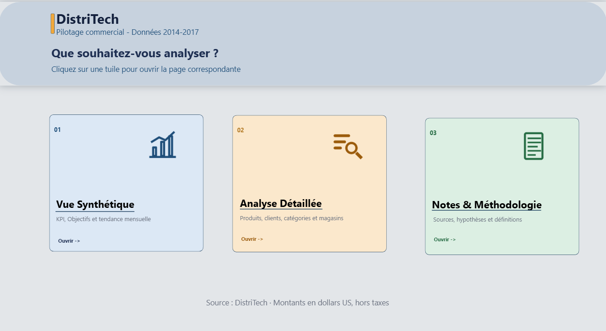
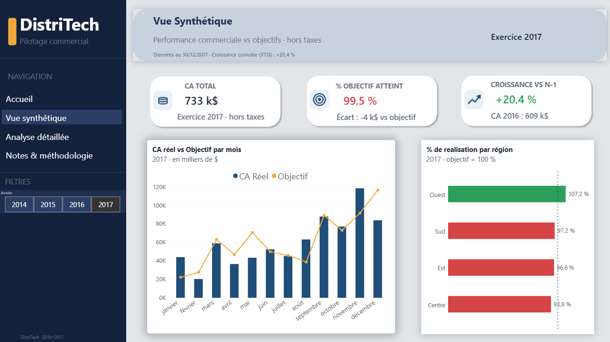
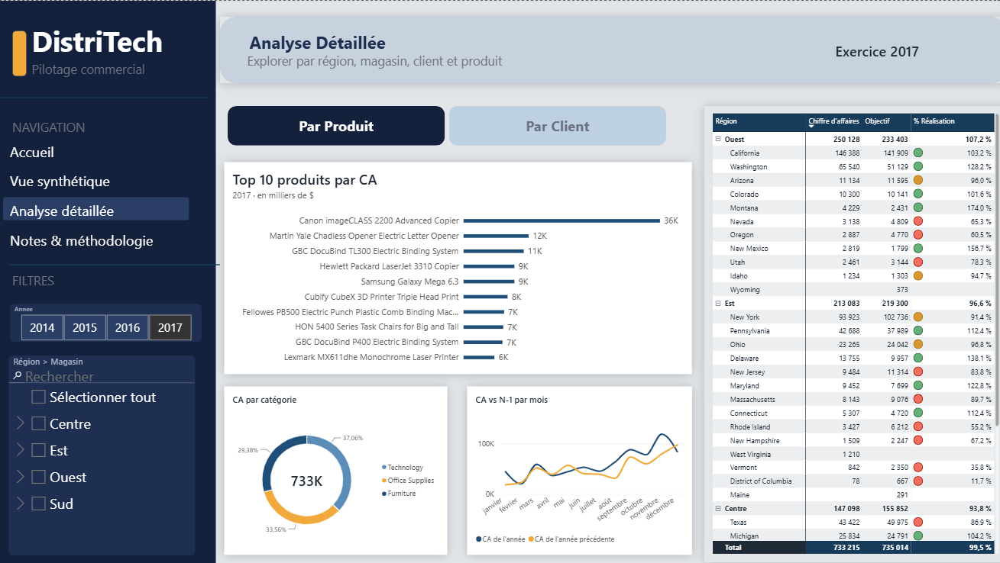
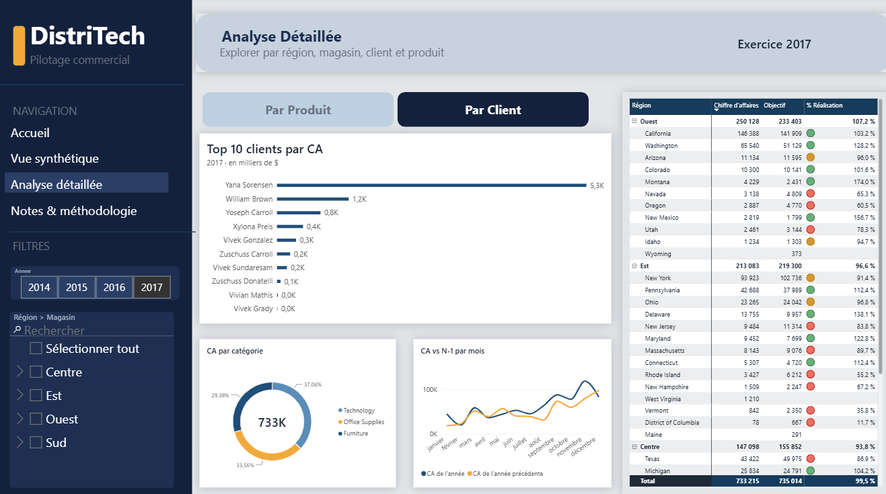
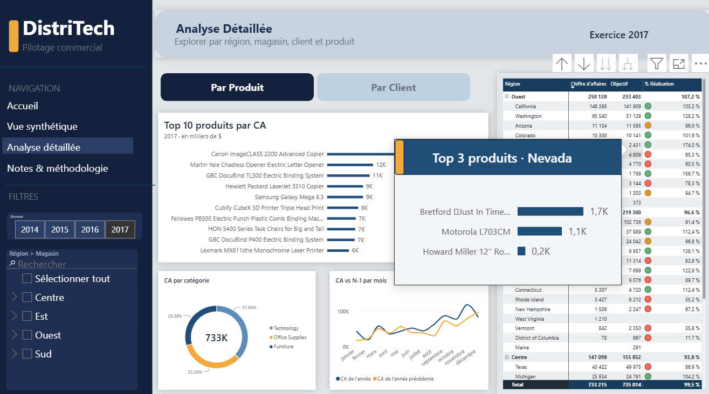
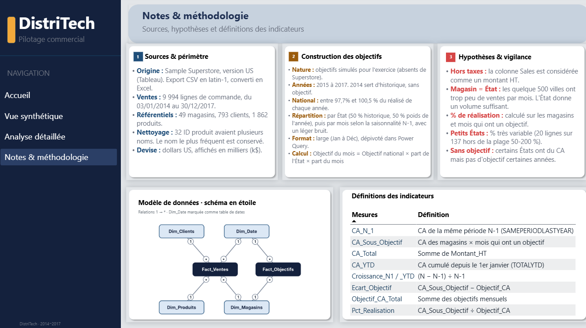
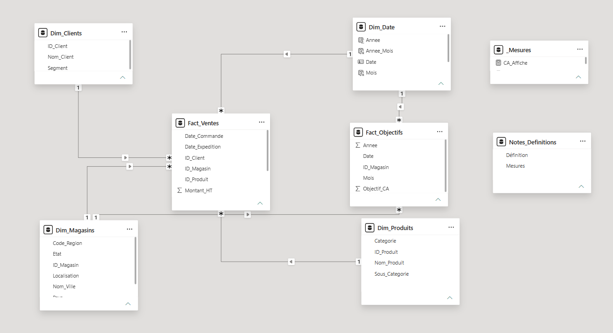

# DistriTech · Tableau de bord de pilotage commercial (Power BI)

Rapport Power BI de pilotage commercial pour une entreprise de distribution fictive, **DistriTech** : suivi du chiffre d'affaires, de l'atteinte des objectifs et de la croissance, par région, magasin, produit et client.



---

## Objectif

La direction commerciale veut suivre ses performances sans consolider à la main plusieurs fichiers Excel. Le rapport répond à trois questions :

1. **Où en est-on par rapport aux objectifs ?** CA réel vs objectif, en montant et en %.
2. **Est-ce qu'on progresse ?** Croissance vs année précédente et cumul depuis janvier (YTD).
3. **Où se situe la performance ?** Par région, magasin, catégorie, produit et client.

## Aperçu des pages

| Page | Contenu |
|---|---|
| **Accueil** | Page d'atterrissage avec tuiles cliquables vers chaque analyse |
| **Vue synthétique** | 3 KPI avec code couleur (CA, % objectif, croissance N-1), CA réel vs objectif par mois, % de réalisation par région |
| **Analyse détaillée** | Segment hiérarchique Région > Magasin, bascule Top produits / Top clients (boutons + signets), CA par catégorie, CA vs N-1 par mois, matrice de performance par magasin |
| **Top 3 produits** | Infobulle personnalisée affichée au survol d'un magasin |
| **Notes & méthodologie** | Sources, construction des objectifs, hypothèses, schéma du modèle et définitions des indicateurs |

### Vue synthétique


### Analyse détaillée
Vue « Par produit » :


Vue « Par client », après un clic sur le bouton (signets) :


Infobulle Top 3 produits au survol d'un magasin :


### Notes & méthodologie


## Ce que le projet met en pratique

**Power Query**
- Import de 2 tables de faits et 3 dimensions
- Dépivotage des 12 colonnes de mois de `Fact_Objectifs` (format large vers format long)
- Construction de la date du 1er du mois à partir de l'année et du mois
- Colonne de localisation `Code_Region - Nom_Ville`
- Typage des colonnes et dédoublonnage des produits (32 ID avaient plusieurs noms)

**Modélisation**
- Schéma en étoile, relations 1 → *
- Table `Dim_Date` marquée comme table de dates
- Deux granularités : ventes au jour, objectifs au mois
- Table dédiée aux mesures (`_Mesures`)

**DAX**
- Mesures de base, écart et % de réalisation
- Time intelligence : `SAMEPERIODLASTYEAR`, `TOTALYTD`
- % de réalisation calculé uniquement sur les magasins × mois qui ont un objectif (`SUMX` + `SUMMARIZE`)
- Mesures de couleur et de texte pour la mise en forme conditionnelle, les sous-titres et les titres dynamiques

Toutes les mesures sont dans [`mesures_dax.md`](mesures_dax.md).

**Visualisation**
- Mise en forme conditionnelle vert / rouge (cartes, barres, icônes de la matrice)
- Boutons et signets pour changer de vue sans surcharger la page
- Infobulle de type page de rapport (Top 3 produits par magasin)
- Navigation entre pages et page d'accueil à tuiles

## Modèle de données



| Table | Lignes | Rôle |
|---|---|---|
| `Fact_Ventes` | 9 994 | Lignes de commande (2014-2017) |
| `Fact_Objectifs` | 137 × 12 mois | Objectifs mensuels par magasin (2015-2017) |
| `Dim_Magasins` | 49 | 1 magasin par État, hiérarchie Région > État |
| `Dim_Clients` | 793 | Clients et segment |
| `Dim_Produits` | 1 862 | Produits, catégorie et sous-catégorie |
| `Dim_Date` | 2014-2017 | Calendrier |

## Hypothèses et limites

- **Hors taxes :** la colonne `Sales` de Superstore est considérée comme un montant HT.
- **Magasin = État :** les quelque 500 villes avaient trop peu de ventes par mois. L'État donne un volume suffisant.
- **Objectifs simulés :** Superstore n'a pas d'objectifs. Ils ont été construits ainsi : objectif du mois = objectif national × part de l'État × part du mois.
  - L'objectif national représente 97,7 % à 100,5 % du CA réel de l'année.
  - La part de l'État est la moyenne de sa part du CA N-1 et de sa part du CA N.
  - La part du mois suit la saisonnalité nationale N-1, avec un léger bruit.
- **2014** sert d'année de référence : elle n'a pas d'objectif et sert au calcul N-1 de 2015.
- **Petits États :** avec peu de commandes, leur % de réalisation varie beaucoup.
- **Devise :** dollars US.

## Contenu du dépôt

```
├── DistriTech_Pilotage.pbix      Rapport Power BI
├── data/
│   └── DistriTech_Donnees.xlsx   Données sources (5 tables)
├── captures/                     Captures d'écran des pages (7 images)
├── mesures_dax.md                Toutes les mesures DAX
└── README.md
```

## Ouvrir le projet

1. Installer [Power BI Desktop](https://www.microsoft.com/fr-fr/power-platform/products/power-bi/desktop) (gratuit, Windows).
2. Télécharger le dépôt.
3. Ouvrir `DistriTech_Pilotage.pbix`. Si Power BI ne trouve pas le fichier source, aller dans **Transformer les données > Paramètres de la source de données** et pointer vers `data/DistriTech_Donnees.xlsx`.

## Auteur

** Yawa Silvere ADODO-DAHOUE ** · [LinkedIn](www.linkedin.com/in/silvereadodo) · [Autre projet](https://github.com/adys-s/nyc-taxi-dbt-project)
